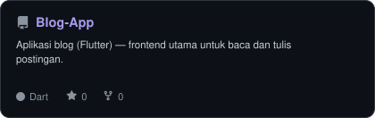
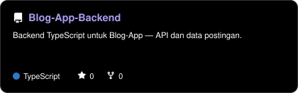
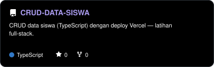
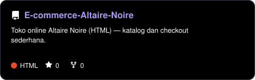
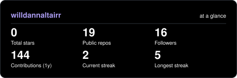

<picture>
  <source media="(prefers-color-scheme: dark)"  srcset="assets/banner-dark.v9.svg">
  <source media="(prefers-color-scheme: light)" srcset="assets/banner-light.v9.svg">
  
</picture>

 

<!-- NAME / TAGLINE - animated typing -->

 

<!-- SOCIALS -->
&nbsp;&nbsp;
&nbsp;&nbsp;
 

---

## This is me :)

Hi, I'm **Wildan**, pelajar SMK (16 tahun) dari Indonesia 🇮🇩.
Fokusku **Coding · AI · Web**, dan lagi serius menata jalan menuju
**Programmer Muda** — belajar mandiri, bangun proyek, dan biasakan shipping.

- 🎯 **Target:** Programmer Muda — kuat di **Python · JavaScript · HTML/CSS**
- 🛠️ **ToolChain:** VS Code · Git · GitHub · Vercel
- 🌱 **Belajar mandiri:** SMA · dokumentasi, tutorial, dan proyek nyata
- 🤖 **Minat:** AI dan Web — dari CRUD sampai Blog App + backend
- 🚀 **Repo andalan:** `Blog-App`, `Blog-App-Backend`, `CRUD-DATA-SISWA`, `E-commerce-Altaire-Noire`
- 💬 Ajak aku ngobrol soal **belajar coding dari nol** — aku jawab sebisaku.
 

## my perfect stack`

---

## signals 

<table>
<tr>
<td width="50%" align="center" valign="middle">

<!-- Self-rated radar - edit assets/skills.json, the workflow redraws it -->
<picture>
  <source media="(prefers-color-scheme: dark)"  srcset="assets/radar-dark.svg">
  <source media="(prefers-color-scheme: light)" srcset="assets/radar-light.svg">
  
</picture>

</td>
<td width="50%" align="center" valign="middle">

<!-- Hand-authored contract & language stack radar - edit assets/langmix.json -->
<picture>
  <source media="(prefers-color-scheme: dark)"  srcset="assets/radar-langs-dark.svg">
  <source media="(prefers-color-scheme: light)" srcset="assets/radar-langs-light.svg">
  
</picture>

</td>
</tr>
</table>

---

## featured projects

<!-- Cards generated by scripts/cards.py from assets/projects.json.
     Stars, forks and language are pulled live from the API on every run. -->
<table>
<tr>
<td width="50%">
  <a href="https://github.com/willdannaltairr/Blog-App">
    <picture>
      <source media="(prefers-color-scheme: dark)"  srcset="assets/card-Blog-App-dark.svg">
      <source media="(prefers-color-scheme: light)" srcset="assets/card-Blog-App-light.svg">
      
    </picture>
  </a>
</td>
<td width="50%">
  <a href="https://github.com/willdannaltairr/Blog-App-Backend">
    <picture>
      <source media="(prefers-color-scheme: dark)"  srcset="assets/card-Blog-App-Backend-dark.svg">
      <source media="(prefers-color-scheme: light)" srcset="assets/card-Blog-App-Backend-light.svg">
      
    </picture>
  </a>
</td>
</tr>
<tr>
<td width="50%">
  <a href="https://github.com/willdannaltairr/CRUD-DATA-SISWA">
    <picture>
      <source media="(prefers-color-scheme: dark)"  srcset="assets/card-CRUD-DATA-SISWA-dark.svg">
      <source media="(prefers-color-scheme: light)" srcset="assets/card-CRUD-DATA-SISWA-light.svg">
      
    </picture>
  </a>
</td>
<td width="50%">
  <a href="https://github.com/willdannaltairr/E-commerce-Altaire-Noire">
    <picture>
      <source media="(prefers-color-scheme: dark)"  srcset="assets/card-E-commerce-Altaire-Noire-dark.svg">
      <source media="(prefers-color-scheme: light)" srcset="assets/card-E-commerce-Altaire-Noire-light.svg">
      
    </picture>
  </a>
</td>
</tr>
</table>

---

## Numbers matter? ohhh yes. 

<!-- Generated by scripts/cards.py into this repo. Deliberately NOT
     github-readme-stats / streak-stats / github-profile-trophy: those are
     shared public instances that go down and take the whole section with them. -->
<picture>
  <source media="(prefers-color-scheme: dark)"  srcset="assets/card-stats-dark.svg">
  <source media="(prefers-color-scheme: light)" srcset="assets/card-stats-light.svg">
  
</picture>

 

---

## arcade zone 👻🚀

My contributions, but make it a game. Pac-Man munches through the year
while the Galaga ship blasts it — auto-updated daily from my real
contribution graph.

<!-- pacman -->
<picture>
  <source media="(prefers-color-scheme: dark)" srcset="https://raw.githubusercontent.com/willdannaltairr/willdannaltairr/output/pacman-contribution-graph-dark.svg">
  <source media="(prefers-color-scheme: light)" srcset="https://raw.githubusercontent.com/willdannaltairr/willdannaltairr/output/pacman-contribution-graph.svg">
  
</picture>

 

<!-- galaga -->
<picture>
  <source media="(prefers-color-scheme: dark)" srcset="https://raw.githubusercontent.com/willdannaltairr/willdannaltairr/output/galaga-contribution-graph-dark.svg">
  <source media="(prefers-color-scheme: light)" srcset="https://raw.githubusercontent.com/willdannaltairr/willdannaltairr/output/galaga-contribution-graph.svg">
  
</picture>

---

` Build with love · @willdannaltairr `

